# Core Concepts

## What is Authentication vs Authorization?

Before diving into implementations, let's clarify two often-confused terms:

| **Authentication** | **Authorization** |
|---|---|
| *"Who are you?"* | *"What can you do?"* |
| Verifies identity | Grants permissions |
| Happens first | Happens after authentication |
| Examples: Login, MFA | Examples: Roles, Scopes, Permissions |


---

## JSON Web Tokens (JWT)

JWT is a compact, URL-safe token format for securely transmitting claims between parties. It's the workhorse of modern stateless authentication.

### JWT Structure

A JWT consists of three Base64URL-encoded parts separated by dots:

```
xxxxx.yyyyy.zzzzz
  │      │      │
  │      │      └── Signature
  │      └── Payload (Claims)
  └── Header
```



```mermaid
graph TB
    subgraph JWT["JWT Token"]
        H["🔷 Header<br/>Algorithm & Type"]
        P["🔶 Payload<br/>Claims (user data, exp, iat)"]
        S["🔐 Signature<br/>HMAC/RSA verification"]
    end
    
    H --> P --> S
    
    style H fill:#3498db,stroke:#333,color:#fff
    style P fill:#f39c12,stroke:#333,color:#fff
    style S fill:#9b59b6,stroke:#333,color:#fff
```

### Decoded JWT Example

```json
// Header
{
  "alg": "HS256",
  "typ": "JWT"
}

// Payload
{
  "sub": "1234567890",
  "name": "John Doe",
  "email": "john@example.com",
  "iat": 1704672000,
  "exp": 1704758400,
  "roles": ["user", "admin"]
}

// Signature
HMACSHA256(
  base64UrlEncode(header) + "." + base64UrlEncode(payload),
  secret
)
```

### JWT Authentication Flow


### Key Points About JWT

| ✅ Strengths | ⚠️ Considerations |
|-------------|-------------------|
| Stateless - no server-side sessions | Cannot be revoked without extra infrastructure |
| Self-contained - all info in token | Payload is encoded, NOT encrypted |
| Scalable across multiple servers | Token size can grow with claims |
| Works great for microservices | Must handle token refresh carefully |

> **⚠️ Important:** JWTs are **signed**, not encrypted. Anyone can decode the payload. Never store sensitive data (passwords, SSNs) in a JWT!

---

## OpenID Connect (OIDC)

OIDC is an identity layer built on top of OAuth 2.0. It answers the question: **"Who is this user?"**

```mermaid
graph TB
    subgraph Stack["The Auth Stack"]
        OIDC["🆔 OpenID Connect<br/>Identity Layer"]
        OAuth["🔑 OAuth 2.0<br/>Authorization Framework"]
        HTTP["🌐 HTTP<br/>Transport"]
    end
    
    OIDC --> OAuth --> HTTP
    
    style OIDC fill:#e74c3c,stroke:#333,color:#fff
    style OAuth fill:#3498db,stroke:#333,color:#fff
    style HTTP fill:#2ecc71,stroke:#333,color:#fff
```



### OIDC Authorization Code Flow (Recommended for Web Apps)


### OIDC Tokens Explained

| Token | Purpose | Audience | Typical Lifetime |
|-------|---------|----------|------------------|
| **ID Token** | Proves user identity (JWT) | Your app | 5-60 minutes |
| **Access Token** | Grants API access | Resource server | 5-60 minutes |
| **Refresh Token** | Gets new tokens | Auth server | Days to months |

### ID Token Claims (Standard)

```typescript
interface IDTokenClaims {
  // Required
  iss: string;    // Issuer (who created the token)
  sub: string;    // Subject (unique user ID)
  aud: string;    // Audience (your client_id)
  exp: number;    // Expiration time
  iat: number;    // Issued at time
  
  // Common optional claims
  email?: string;
  email_verified?: boolean;
  name?: string;
  picture?: string;
  locale?: string;
}
```

---

## OAuth 2.0

OAuth 2.0 is the **authorization** framework that OIDC builds upon. It handles **what users can access**, not who they are.

### OAuth 2.0 Scopes

Scopes define the level of access being requested:

```typescript
// Common OAuth scopes
const scopes = [
  'openid',        // Required for OIDC - returns ID token
  'profile',       // User's name, picture, etc.
  'email',         // User's email address
  'offline_access' // Get refresh token
];

// Google-specific scopes
const googleScopes = [
  'https://www.googleapis.com/auth/calendar.readonly',
  'https://www.googleapis.com/auth/drive.file'
];
```

---

[← Back to Authentication Guide](../Authentication-Guide.md)
