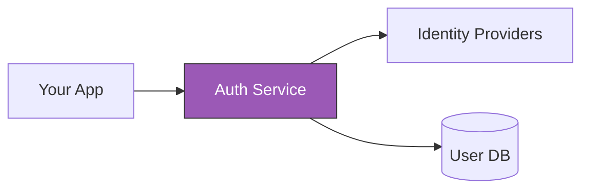
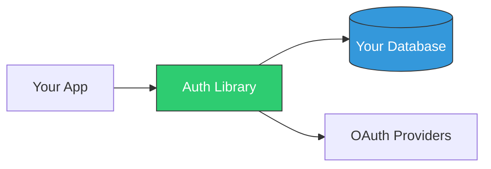
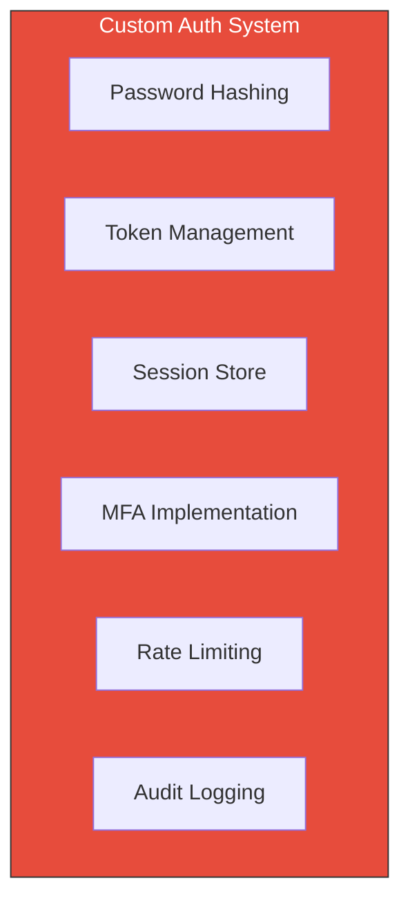
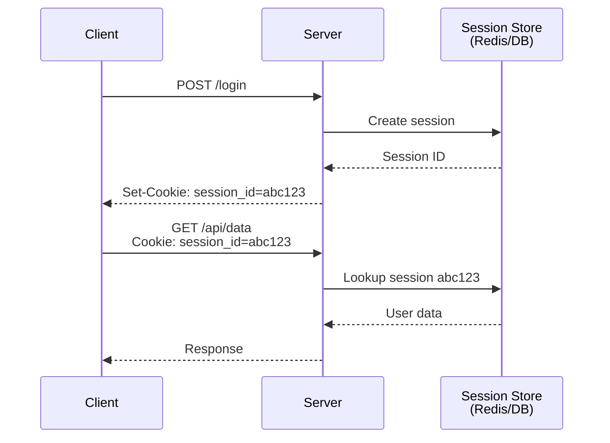
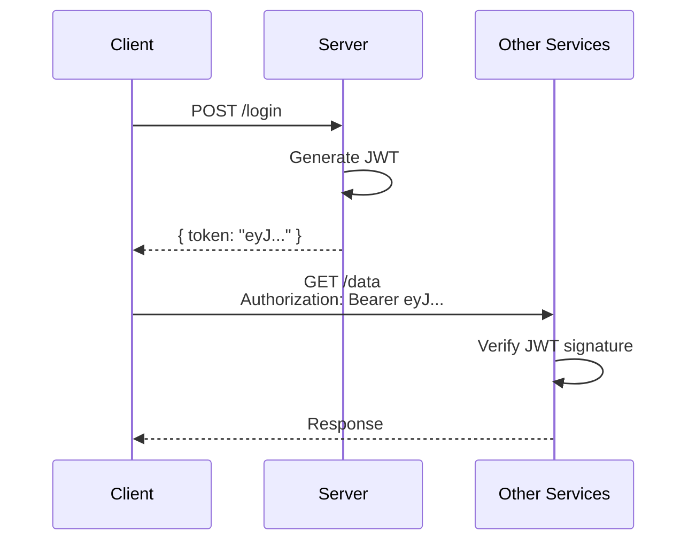

# Implementation Types

## 1. Third-Party Authentication Services

**Examples:** Clerk, Auth0, Firebase Auth, Supabase Auth, Kinde



| ✅ Strengths | ❌ Weaknesses |
|-------------|--------------|
| Fastest time to production | Recurring costs (per MAU) |
| Managed security updates | Data stored on third-party servers |
| Built-in compliance (SOC 2, GDPR) | Limited customization |
| SDKs for all frameworks | Potential vendor lock-in |
| Pre-built UI components | Rate limits and quotas |

**Best for:** Startups, MVPs, teams without security expertise

### Example: Clerk

```typescript
// Clerk is extremely simple to integrate
import { ClerkProvider, SignedIn, SignedOut } from '@clerk/nextjs';

export default function App({ children }) {
  return (
    <ClerkProvider>
      <SignedIn>{children}</SignedIn>
      <SignedOut>
        <RedirectToSignIn />
      </SignedOut>
    </ClerkProvider>
  );
}
```

---

## 2. Self-Hosted Authentication Solutions

**Examples:** Better Auth, Lucia Auth, Keycloak, Authentik



| ✅ Strengths | ❌ Weaknesses |
|-------------|--------------|
| Full data ownership | More initial setup |
| No per-user costs | You handle security updates |
| Complete customization | Requires auth knowledge |
| No vendor lock-in | Self-managed infrastructure |
| Works offline | Compliance is your responsibility |

**Best for:** Privacy-focused apps, regulated industries, cost-conscious scaling

---

## 3. Custom-Built Authentication Systems

**When to build custom:** Almost never for most teams.



| ✅ Strengths | ❌ Weaknesses |
|-------------|--------------|
| Maximum flexibility | Extremely time-consuming |
| Perfect fit for unique needs | High security risk |
| No external dependencies | Requires deep expertise |
| Complete control | Ongoing maintenance burden |

**Best for:** Companies with dedicated security teams, unique compliance needs

> **⚠️ Warning:** Rolling your own auth is a common source of security vulnerabilities. Unless you have specific requirements that can't be met by existing solutions, use a battle-tested library or service.

---

## 4. Session-Based vs Token-Based Authentication

### Session-Based Authentication



| ✅ Strengths | ❌ Weaknesses |
|-------------|--------------|
| Easy to revoke | Requires session store |
| Smaller payload (just ID) | Scaling requires shared store |
| Server controls validity | Not ideal for microservices |
| CSRF protection possible | Cookies don't work well for mobile |

### Token-Based Authentication (JWT)



| ✅ Strengths | ❌ Weaknesses |
|-------------|--------------|
| Stateless / scalable | Hard to revoke |
| Works across domains | Larger payload |
| Great for microservices | Must handle refresh flow |
| Mobile-friendly | Token theft = full access |

### Hybrid Approach (Recommended)

Modern apps often use **both**:

```typescript
// Hybrid: Session for web, JWT for API
interface AuthStrategy {
  web: 'session';      // httpOnly cookies for browser
  api: 'jwt';          // Bearer tokens for mobile/SPAs
  internal: 'jwt';     // Service-to-service
}
```

---

[← Back to Authentication Guide](../Authentication-Guide.md)
