# Implementation Types

## 1. Third-Party Authentication Services

**Examples:** Clerk, Auth0, Firebase Auth, Supabase Auth, Kinde


| ✅ Strengths | ❌ Weaknesses |
|-------------|--------------|
| Fastest time to production | Recurring costs (per MAU) |
| Managed security updates | Data stored on third-party servers |
| Built-in compliance (SOC 2, GDPR) | Limited customization |
| SDKs for all frameworks | Potential vendor lock-in |
| Pre-built UI components | Rate limits and quotas |

**Best for:** Startups, MVPs, teams without security expertise

### Example: Clerk

```typescript
// Clerk is extremely simple to integrate
import { ClerkProvider, SignedIn, SignedOut } from '@clerk/nextjs';

export default function App({ children }) {
  return (
    <ClerkProvider>
      <SignedIn>{children}</SignedIn>
      <SignedOut>
        <RedirectToSignIn />
      </SignedOut>
    </ClerkProvider>
  );
}
```

---

## 2. Self-Hosted Authentication Solutions

**Examples:** Better Auth, Lucia Auth, Keycloak, Authentik


| ✅ Strengths | ❌ Weaknesses |
|-------------|--------------|
| Full data ownership | More initial setup |
| No per-user costs | You handle security updates |
| Complete customization | Requires auth knowledge |
| No vendor lock-in | Self-managed infrastructure |
| Works offline | Compliance is your responsibility |

**Best for:** Privacy-focused apps, regulated industries, cost-conscious scaling

---

## 3. Custom-Built Authentication Systems

**When to build custom:** Almost never for most teams.


| ✅ Strengths | ❌ Weaknesses |
|-------------|--------------|
| Maximum flexibility | Extremely time-consuming |
| Perfect fit for unique needs | High security risk |
| No external dependencies | Requires deep expertise |
| Complete control | Ongoing maintenance burden |

**Best for:** Companies with dedicated security teams, unique compliance needs

> **⚠️ Warning:** Rolling your own auth is a common source of security vulnerabilities. Unless you have specific requirements that can't be met by existing solutions, use a battle-tested library or service.

---

## 4. Session-Based vs Token-Based Authentication

### Session-Based Authentication


| ✅ Strengths | ❌ Weaknesses |
|-------------|--------------|
| Easy to revoke | Requires session store |
| Smaller payload (just ID) | Scaling requires shared store |
| Server controls validity | Not ideal for microservices |
| CSRF protection possible | Cookies don't work well for mobile |

### Token-Based Authentication (JWT)


| ✅ Strengths | ❌ Weaknesses |
|-------------|--------------|
| Stateless / scalable | Hard to revoke |
| Works across domains | Larger payload |
| Great for microservices | Must handle refresh flow |
| Mobile-friendly | Token theft = full access |

### Hybrid Approach (Recommended)

Modern apps often use **both**:

```typescript
// Hybrid: Session for web, JWT for API
interface AuthStrategy {
  web: 'session';      // httpOnly cookies for browser
  api: 'jwt';          // Bearer tokens for mobile/SPAs
  internal: 'jwt';     // Service-to-service
}
```

---

## 5. Magic Link (Passwordless) Authentication

Magic link authentication lets users sign in by clicking a unique, time-limited link sent to their email — no password required.

```mermaid
sequenceDiagram
    autonumber
    participant U as User
    participant App as Your App
    participant DB as Database
    participant Email as Email Service

    U->>App: POST /auth/magic-link<br/>{email: "user@example.com"}
    App->>App: Generate secure token
    App->>DB: Store token + expiry + email
    App->>Email: Send magic link email
    Email-->>U: 📧 "Click here to sign in"
    App-->>U: "Check your email!"

    Note over U: User clicks link in email

    U->>App: GET /auth/verify?token=abc123
    App->>DB: Lookup token
    DB-->>App: Token valid ✓
    App->>DB: Invalidate token (single-use)
    App->>App: Create session / issue JWT
    App-->>U: Set-Cookie + redirect to dashboard
```



| ✅ Strengths | ❌ Weaknesses |
|-------------|--------------|
| No passwords to remember or leak | Requires access to email |
| Eliminates credential stuffing attacks | Slower UX (email delivery delay) |
| Simpler sign-up flow | Email deliverability issues |
| No password reset flow needed | Phishing risk (fake emails) |
| Great for infrequent-use apps | Relies on email provider security |

**Best for:** SaaS products, internal tools, apps where users log in infrequently, and teams that want to minimize password-related support tickets.

### Implementation

```typescript
// src/auth/magic-link.ts
import crypto from 'node:crypto';

interface MagicLinkToken {
  token: string;
  email: string;
  expiresAt: Date;
  used: boolean;
}

// In production, use your database — this is illustrative
const tokenStore = new Map<string, MagicLinkToken>();

/**
 * Generate a cryptographically secure magic link token
 */
export function createMagicLinkToken(email: string): string {
  // Invalidate any existing tokens for this email
  for (const [key, entry] of tokenStore) {
    if (entry.email === email) {
      tokenStore.delete(key);
    }
  }

  const token = crypto.randomBytes(32).toString('base64url');

  tokenStore.set(token, {
    token,
    email,
    expiresAt: new Date(Date.now() + 15 * 60 * 1000), // 15 minutes
    used: false,
  });

  return token;
}

/**
 * Verify a magic link token and return the associated email
 */
export function verifyMagicLinkToken(token: string): string | null {
  const entry = tokenStore.get(token);

  if (!entry) return null;
  if (entry.used) return null;

  if (new Date() > entry.expiresAt) {
    tokenStore.delete(token);
    return null;
  }

  // Mark as used (single-use enforcement)
  entry.used = true;
  tokenStore.delete(token);

  return entry.email;
}
```

```typescript
// src/routes/magic-link.ts
import { Router, Request, Response } from 'express';
import { createMagicLinkToken, verifyMagicLinkToken } from '../auth/magic-link';
import { sendMagicLinkEmail } from '../email/sender';
import { generateTokens } from '../auth/jwt';

const router = Router();
const BASE_URL = process.env.BASE_URL!;

// Step 1: User requests a magic link
router.post('/auth/magic-link', async (req: Request, res: Response) => {
  const { email } = req.body;

  if (!email || typeof email !== 'string') {
    res.status(400).json({ error: 'Valid email is required' });
    return;
  }

  const token = createMagicLinkToken(email.toLowerCase().trim());
  const magicLink = `${BASE_URL}/auth/verify?token=${token}`;

  try {
    await sendMagicLinkEmail(email, magicLink);
  } catch (error) {
    console.error('Failed to send magic link email:', error);
  }

  // Always return success to prevent email enumeration
  res.json({ message: 'If that email is registered, a sign-in link has been sent.' });
});

// Step 2: User clicks the link in their email
router.get('/auth/verify', async (req: Request, res: Response) => {
  const { token } = req.query;

  if (!token || typeof token !== 'string') {
    res.status(400).json({ error: 'Invalid link' });
    return;
  }

  const email = verifyMagicLinkToken(token);

  if (!email) {
    res.status(401).json({ error: 'Link is invalid or has expired' });
    return;
  }

  // Find or create user in your database
  // const user = await db.user.upsert({ ... });

  const tokens = generateTokens({ userId: 'user-id-from-db', email, roles: ['user'] });

  res.cookie('session', tokens.accessToken, {
    httpOnly: true,
    secure: true,
    sameSite: 'lax',
    maxAge: 7 * 24 * 60 * 60 * 1000, // 7 days
  });

  res.redirect('/dashboard');
});

export default router;
```

### Better Auth Magic Link Plugin

```typescript
// Server — src/lib/auth.ts
import { betterAuth } from 'better-auth';
import { magicLink } from 'better-auth/plugins';

export const auth = betterAuth({
  // ... database & other config
  plugins: [
    magicLink({
      sendMagicLink: async ({ email, token, url }) => {
        await sendEmail({
          to: email,
          subject: 'Your sign-in link',
          html: `<a href="${url}">Click here to sign in</a>`,
        });
      },
      expiresIn: 60 * 15, // 15 minutes (in seconds)
    }),
  ],
});
```

```typescript
// Client — src/lib/auth-client.ts
import { createAuthClient } from 'better-auth/react';
import { magicLinkClient } from 'better-auth/client/plugins';

export const authClient = createAuthClient({
  baseURL: process.env.NEXT_PUBLIC_APP_URL!,
  plugins: [magicLinkClient()],
});

// Usage: authClient.signIn.magicLink({ email, callbackURL: '/dashboard' })
```

### Security Checklist for Magic Links

| Practice | Why |
|----------|-----|
| **Short expiry (10–15 min)** | Limits the window for interception |
| **Single-use tokens** | Prevents replay attacks |
| **Cryptographically random tokens** | Use `crypto.randomBytes`, not `Math.random` |
| **Constant-time comparison** | Prevents timing attacks when verifying tokens |
| **Rate limiting** | Prevents email flooding / abuse |
| **Generic responses** | "If that email is registered…" prevents email enumeration |
| **HTTPS only** | Tokens in URLs must never travel over plain HTTP |

### When to Choose Magic Links

| Scenario | Magic Links | Password | OAuth/SSO |
|----------|:-----------:|:--------:|:---------:|
| Internal tools | ✅ Great | ⚠️ OK | ✅ Great |
| Consumer SaaS | ✅ Great | ✅ Great | ✅ Great |
| High-frequency login | ❌ Slow | ✅ Great | ✅ Great |
| Mobile apps | ⚠️ Friction | ✅ Great | ✅ Great |
| No email access | ❌ No | ✅ Great | ✅ Great |
| Security-critical | ✅ + MFA | ⚠️ Risky | ✅ Great |

---

[← Back to Authentication Guide](../Authentication-Guide.md)
