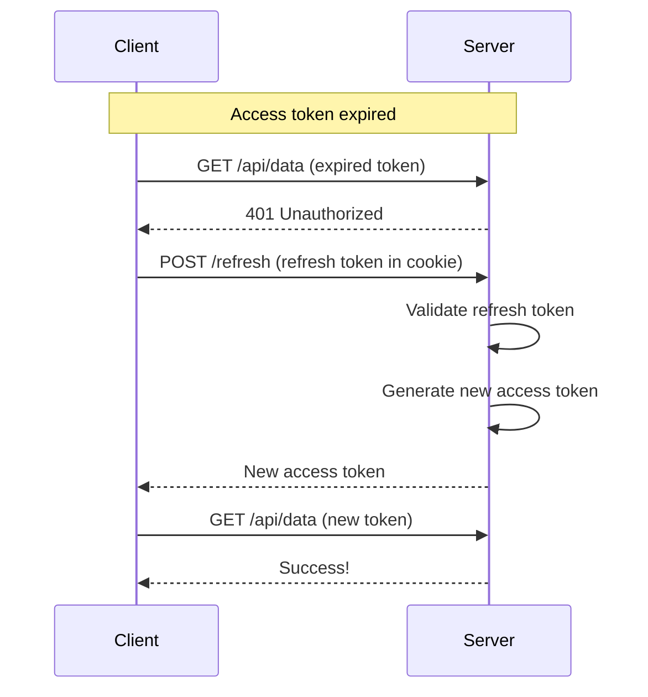

# Security Best Practices

## 1. Token Security

```typescript
// ❌ DON'T: Store tokens in localStorage
localStorage.setItem('token', jwt); // XSS vulnerable!

// ✅ DO: Use httpOnly cookies
res.cookie('token', jwt, {
  httpOnly: true,     // Not accessible via JavaScript
  secure: true,       // HTTPS only
  sameSite: 'lax',    // CSRF protection
  maxAge: 15 * 60 * 1000, // 15 minutes
});

// ✅ DO: For SPAs, store in memory + use refresh tokens
class TokenManager {
  private accessToken: string | null = null;
  
  setToken(token: string) {
    this.accessToken = token;
  }
  
  getToken() {
    return this.accessToken;
  }
  
  // Refresh token stored in httpOnly cookie
}
```

## 2. Password Security

```typescript
import { hash, verify } from '@node-rs/argon2';

// ✅ Use Argon2id for password hashing
async function hashPassword(password: string): Promise<string> {
  return await hash(password, {
    memoryCost: 65536,  // 64 MB
    timeCost: 3,        // 3 iterations
    parallelism: 4,     // 4 parallel threads
  });
}

async function verifyPassword(
  password: string, 
  hashedPassword: string
): Promise<boolean> {
  return await verify(hashedPassword, password);
}
```

## 3. Rate Limiting

```typescript
import rateLimit from 'express-rate-limit';

// Protect auth endpoints
const authLimiter = rateLimit({
  windowMs: 15 * 60 * 1000, // 15 minutes
  max: 5,                    // 5 attempts per window
  message: 'Too many login attempts, please try again later',
  standardHeaders: true,
  legacyHeaders: false,
});

app.use('/api/auth/login', authLimiter);
app.use('/api/auth/register', authLimiter);
```

## 4. Token Refresh Strategy



```typescript
// Axios interceptor for automatic refresh
axios.interceptors.response.use(
  (response) => response,
  async (error) => {
    const originalRequest = error.config;
    
    if (error.response?.status === 401 && !originalRequest._retry) {
      originalRequest._retry = true;
      
      try {
        const { data } = await axios.post('/api/auth/refresh');
        tokenManager.setToken(data.accessToken);
        originalRequest.headers.Authorization = `Bearer ${data.accessToken}`;
        return axios(originalRequest);
      } catch {
        // Refresh failed, redirect to login
        window.location.href = '/login';
      }
    }
    
    return Promise.reject(error);
  }
);
```

---

[← Back to Authentication Guide](../Authentication-Guide.md)
