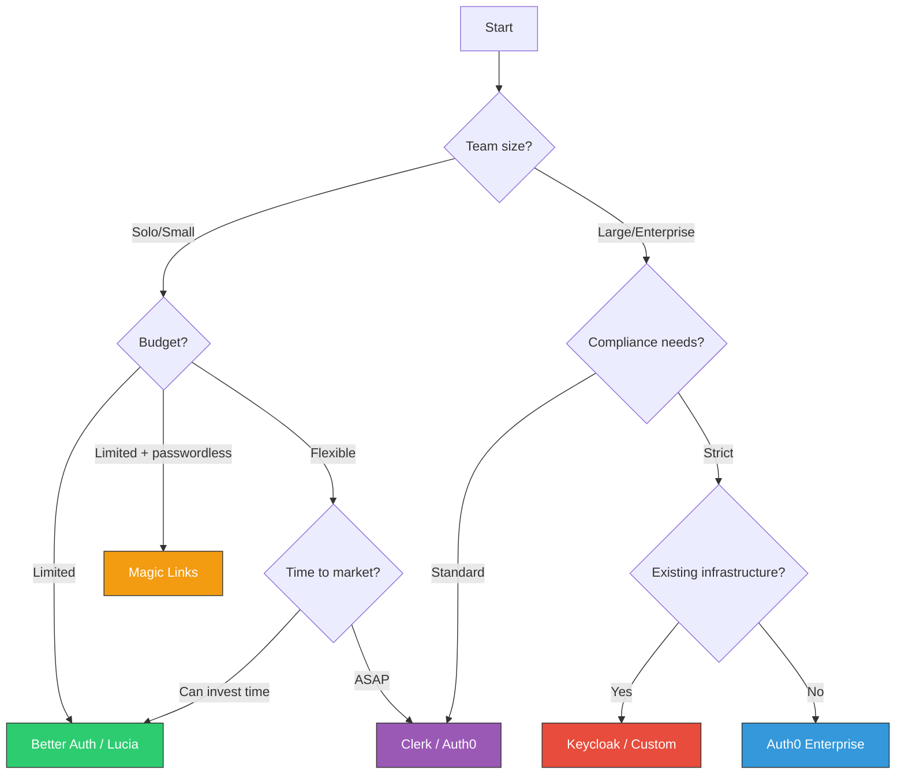

# Choosing the Right Approach

## Quick Decision Matrix

| Scenario | Recommendation | Why |
|----------|---------------|-----|
| **MVP / Hackathon** | Clerk | Fastest setup, free tier |
| **Startup (cost-conscious)** | Better Auth | No per-user fees, full control |
| **B2B SaaS** | Auth0 / WorkOS | Enterprise SSO support |
| **Privacy-first app** | Better Auth / Lucia | Self-hosted, data ownership |
| **Mobile app** | Firebase Auth | Great mobile SDKs |
| **Microservices** | JWT + JWKS | Stateless, decentralized |
| **Internal tools** | Magic Links | No passwords to manage, simple UX |
| **Infrequent login app** | Magic Links | Low friction, no credential fatigue |
| **Enterprise / Regulated** | Keycloak / Okta | Compliance, audit trails |

---

## Conclusion

Authentication is a critical piece of any application, and choosing the right approach depends on your specific needs:

1. **Start simple** - Use a third-party service for MVPs
2. **Own your data** - Consider self-hosted solutions like Better Auth as you scale
3. **Never roll your own** - Unless you have specific requirements and security expertise
4. **Layer your defenses** - MFA, rate limiting, secure token storage
5. **Go passwordless when it fits** - Magic links reduce attack surface for internal tools and low-frequency apps
6. **Plan for scale** - Consider stateless auth for microservices

The TypeScript ecosystem has excellent options at every level. Pick the one that matches your team's expertise and your application's requirements.

---

## Further Reading

- [JWT.io](https://jwt.io/) - JWT debugger and introduction
- [OpenID Connect Spec](https://openid.net/specs/openid-connect-core-1_0.html)
- [OAuth 2.0 Security Best Practices](https://datatracker.ietf.org/doc/html/draft-ietf-oauth-security-topics)
- [Better Auth Documentation](https://www.better-auth.com/docs)
- [OWASP Authentication Cheat Sheet](https://cheatsheetseries.owasp.org/cheatsheets/Authentication_Cheat_Sheet.html)

---

[← Back to Authentication Guide](../Authentication-Guide.md)
